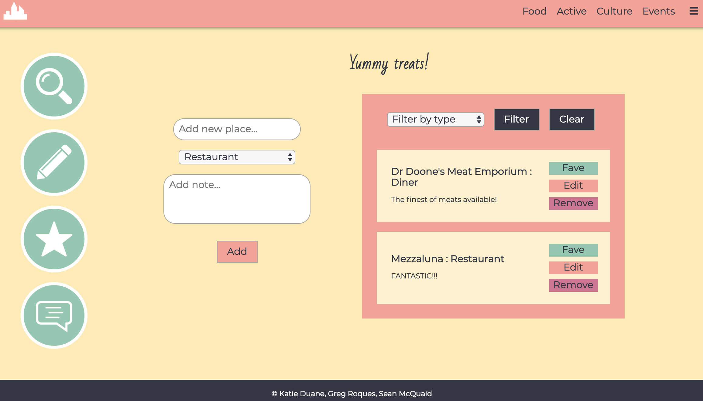
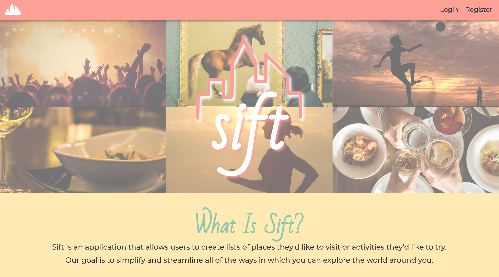
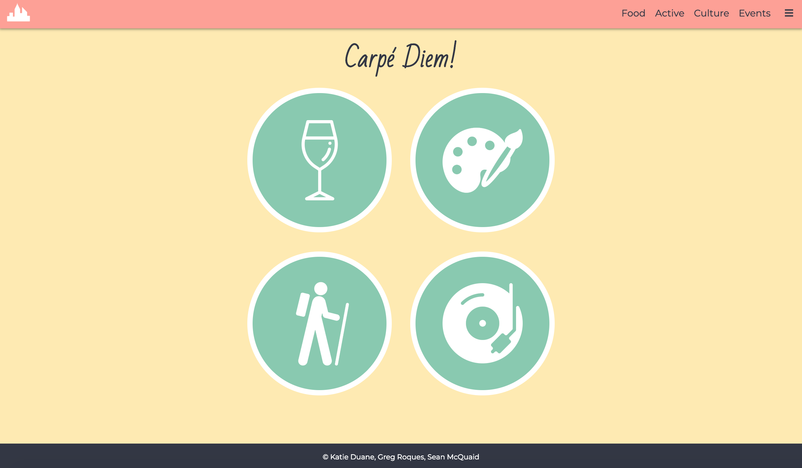
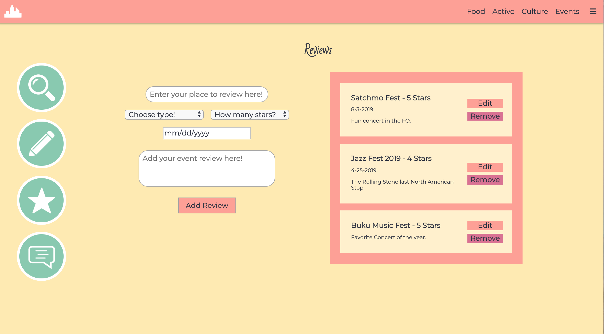
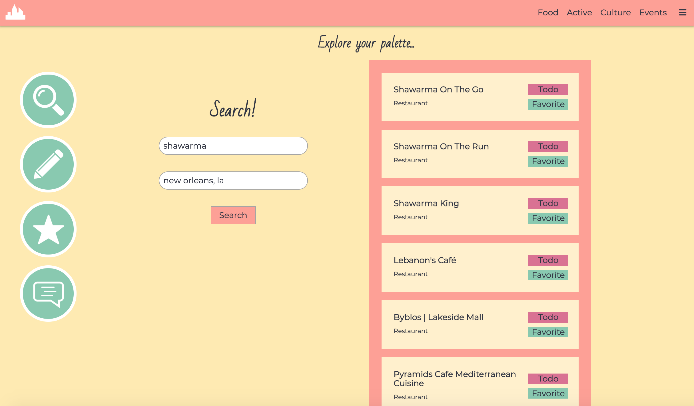

# Sift


## Contents
* Description
* Technologies
* Challenges and Solutions
* MVP
* Stretch Goals
* Authors

## Description
Sift is a PERN stack web application that allows users to organize their leisure activities by category. Once the user is in that category, they are able to create to do lists with notes, create favorite lists and write their own personal reviews.


## Features
* Users can categorize their lists based on whether it falls into any of the following categories:
    * Food
    * Active
    * Events
    * Culture
* The user has the ability to search within each category for potential activities and the option to add them to their todo or favorties list
* The user is able to add, edit or remove item from their todo and favorites lists
* The user can write personal reviews about their favorite places allowing them to keep a record of their favorite experiences for each location

## Technologies
- React/Redux
- HTML/CSS/JavaScript
- Node.js/Express
- PostgreSQL
- Google Maps/Places API


## Challenges & Solutions
* Edit
    * We struggled to come up with a solution that allowed us to pass data to the Edit page so the form would autopopulate with the selected place to edit without using Redux. We knew that using Redux wasn't necessarily needed or appropriate in this situation. So after doing a bit of research, we discovered that you could use Params on the Front End in Link components. This was an aboslute game changer and allowed us to easily create a way to grab information about the specified place to edit.
    ```
    componentDidMount() {
        const placename = this.props.match.params.place;
        const section = this.props.match.params.section;
        const category = this.props.match.params.category;
        axios({
            method: 'POST',
            url: `${window.apiHost}/${category}/${section}/getPlaceToEdit/${placename}`,
            data: {
                email: this.props.login.email
            }
        }).then((responseFromDB) => {
            let textFromDB = responseFromDB.data.note || responseFromDB.data.review
            let placeFromDB = responseFromDB.data.placename || responseFromDB.data.eventname
            let starsFromDB = responseFromDB.data.stars 
            this.setState({
                place : placeFromDB,
                category : category,
                type : responseFromDB.data.type,
                text : textFromDB,
                stars: starsFromDB
            })
        })
    }
    ```

* Reusable Routing / Redirect Issues
    * Previously, we only knew how to handle redirects and reusable routes in Express. Now with the React Router, we were able to create dynamic routes that would use params so our backend could be more flexible between categories. In addition, we used the Redirect component to handle if the user was not logged in and tried to access a page that should only be available to a logged in user.
    * Front End:
    ```
    <Link to={"/userHome/"+ category + "/edit/" + section + "/" + food.placename} >Edit</Link>
    ```
    * Back End: 
    ```
    router.post('/:section/getPlaceToEdit/:placename',(req, res, next)=>{
        ...
    }
    ```

* Events
    * For the events category, it is necessary for the user to include a date as these activities may take place on specific days. Separate forms and individualized conditions were created to accommodate this option across the categories functionality. Additionally, it was necessary to store both computer and user readable dates in the database; this allowed the application to format dates in order when categories were selected, and to display them in a format consistent for Western readers. Parameters were also added to the input form making it easier for users to navigate setting dates and reducing user typos.
    ```
    changeDate = (event) => {
       var date= event.target.value

       var currDate = (date).toString().slice(0,10)
       var currYear = currDate.slice(0,4)
       var currMonDay = (currDate.slice(6,10)).replace(/-0+/g, '-');
       var publishDate = `${currMonDay}-${currYear}`
       this.setState({
           readabledate: publishDate,
           date: date
       })
    }

    render(){
        let minDate = new Date().toISOString().slice(0,10);
        let maxDate = '2030-03-10'
        return(
            <div className="AddEventFormContainer">
                <form onSubmit={this.addNewEvent} className="AddEventForm">
                    <div className="addEventName">
                        <input onChange={this.changeEvent} type="text" id="NewAddEvent" placeholder={this.props.placeholder} value={this.state.events} required />
                    </div>
                    <div className="addEventTypeAndDate">
                        <select className="Dropdown Type" id="NewEventTypeDropdown" onChange={this.changeType} required>
                            <option value="">{this.props.defaultType}</option>
                            {this.props.types}
                        </select>
                        <input onChange={this.changeDate} id="NewEventDateDropdown" type="date" min={minDate} max={maxDate} value={this.state.date} required />
                    </div>
        }
        ```

* UI/UX Overhaul
    * After nearly completing our project, we realized that the UI wasn't as conducive to a good UX. Upon this realization, we reworked the CSS to consolidated files for each section and also redid positioning and responsiveness to allow for less clicking around for the user. The navbar was also integral in allowing our uses to easily navigate the different categories of the app. 

* Debugging
    * Due to how massive this project became, we had to debug as went along. Sometimes, if we changed one route in a category, we would have to comb through each file within the other categories to make sure that it would align with previous changes. We dedicated roughly an hour to two hours a day to just debug previous code we had written as we implemented more features. 

## MVP
* Create a PERN stack app that would allow users to search for new restaurants, create todo lists with notes about restaurants, maintain a list of favorite restaurants and write personal reviews
* Requirements:
    * User's login information is stored within a PostGreSQL database
    * User should be able to search for recommendations based on location and what they want to search for
    * User can create todo lists of places they've never been or want to try
    * User can favorite places they've gone before or recently tried 
    * User is able to write reviews about places they've gone previously 


## Stretch Goals
* Implement more categories with the same features as Food - Active, Culture and Events
    * Status: Complete


## Authors
* Sean McQuaid
  * Contributions: Login and registration connection, Implementation of Redux, Implentation of React Router, Routing for redirects in Protected Component, Mobile Responsiveness, Mobile and Desktop Navigation, Front End and Back End code for "Reviews" and "Culture" sections, Google Places API Implementation, Edit Logic, Reusable Routing, Debugging
  * [GitHub Profile](https://github.com/seanmcquaid)

* Katie Duane
  * Contributions: Logo Design, Database Schema and Set-up, Responsive Design, Creation of re-usable React Components for each category, Initialized database connection, CSS debugging, Front End and Back End code for "To-Do" list and "Active" sections, Edit Logic, UI/UX overhaul, Debugging, Mobile Responsiveness
  * [GitHub Profile](https://github.com/katiejduane)
  
* Greg Roques
  * Contributions: Wireframes, Style Guide and Designs, Mark-up and CSS for Splash and User Home pages, CSS animations, Router debugging, Front End and Back End code for "Favorites" list and "Event" sections, Debugging, Mobile Responsiveness
  * [GitHub Profile](https://github.com/gregroques)

## Screenshots
* Splash Page



* User Home Page



* Review Page



* Explore Page

